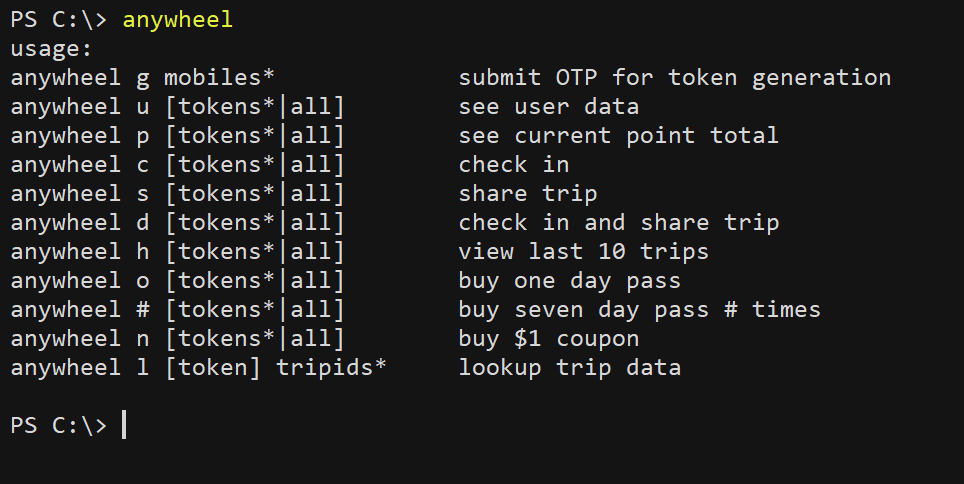

# anywheel

In this repo are scripts intended to help us do things in anywheel more cheaply or conveniently. **It is in our best interest not to share the contents of this repo widely.** In some cases, the scripts depend on unintended features of the app, and we have their benefits only for as long as those features aren't patched. The likelihood and imminence of patches is lower if the relevant features are not widely exploited.

If you can run python scripts in your machine, it's most convenient to use [anywheel.py](anywheel.py), the instructions for which are [below](#python). Otherwise, you can try the

### Alternatives
One alternative is to use the notebook, which you can either [download](anywheel.ipynb) or run from [Google Colab](https://colab.research.google.com/drive/1m0o6RYJmMoLG2Mzl7RHIGr0YojsdAke9). The notebook itself has usage instructions, but if you need more help you can look at the [step-by-step instructions](ipynb-instructions.pdf).

For windows users, a limited number of script functions have been written as commands you can run from [Powershell](powershell.md). For Linux/Mac users, something I plan to do in future is to translate the PS commands to Bash.

<a name="python"/>

## anywheel.py

### Setup
Download the script [here](anywheel.py). The script depends on the python [requests library](https://pypi.org/project/requests/), so make sure you've installed that. If you think you're all set, run the script without arguments. if you see the help message, you're good to go.

### Functions
Run the script without arguments to see the help message, which enumerates the script's functions

### Getting a token
Most of the script's functions require a valid authentication token. As far as i know, there are two ways to get one.

##### Method 1: Observe the network traffic
One way to retrieve a token is to run the app on your phone while directing your phone's network traffic through a proxy. Anywheel doesn't pin the SSL cert of the remote endpoint, but it only trusts system CAs, so in addition to [installing a root CA](https://portswigger.net/burp/documentation/desktop/external-browser-config/certificate), you'll also have to [give it system-level trust](https://support.apple.com/en-nz/HT204477). Unfortunately, to my knowledge, there isn't a way to do this for unrooted Android devices (if you know a way, I'm interested to know). So Android users have to go to method 2 below.

With the app traffic going through a proxy, you can find your account's authentication token in the X-Atayun-Token header of requests:

##### Method 2: Generate a new token
**This method will log you out of existing sessions**, so it's less preferable to the previous method. The anywheel.py script can simulate the login process and give you the generated token, which will be valid for as long as you don't log in anywhere else. As is the case with the usual login, you will need to supply an OTP sent to the mobile number registered with your account.

Run the script with the argument g followed by the mobile number associated with your anywheel account. If the number you provided is valid (the script assumes that all the mobile numbers are Singaporean), the script will tell you that an OTP has been sent to that number and ask you for the OTP value:

If you don't receive an SMS with an OTP after about a minute, abort the script (enter 'quit' at the prompt) and try again. When you get the OTP value, enter it at the prompt. If the value you entered was correct, a valid authentication token for your account will be printed to the console. Note that value for use with the other script functions.

After you've done whatever you want to with the script, you can either keep the token value for future use or log back in to your usual device and discard the token value generated here.

### Using the token
There are three ways to give the script your token. One way is to pass it as a command-line argument. For instance, run the script with the p argument followed by the value(s) of your token(s) to see your point total(s):

The second way is to add it as a parameter to the script, which at the same time saves your token value for you. Change the first line of the script so that the value of the token variable is your token value, given as a string. Then run the script with just the p argument to see your point total:

A third way is to add it as the value of an entry in the cache dictionary. The key of the entry is an alias of your choice. You can then tell the script to use that token by passing that alias (or multiple aliases) as a command line argument.

The advantage of this last method is that it not only allows you to save your token value, it also allows you to save multiple token values while doing things with them individually. You can also tell the script to do something to all the tokens saved in the cache using the alias 'all':

### Functions
Now to put the script to work.

##### Buy pass
In 2022, anywheel updated their app and raised the price for pass redemption. At the beginning of the year we could get a 1-day pass for 100 points and a 7-day pass for 200 points. After the update it became 300 points for a 1-day pass and 500 points for a 3-day pass. This script allows you to redeem passes at the old rate. Use the argument 'o' to redeem a 1-day pass for 100 points once (I assume you'll never want to redeem a 1-day pass more than once, since if you have 200 points you might as well get a 7-day pass). Put a positive integer as the argument to redeem a 7-day pass for 200 points that number of times. Put 0 as the argument to redeem 7-day passes until you have less than 200 points.

##### Account information
Use the argument 'p' as above to see your point total. Use 'u' to see your user info, and 'h' to see information about your recent trip history.

##### Daily tasks
While farming points in anywheel you will want to check in and share trips daily. Use the argument 'c' to check in, 's' to share a recent trip (<72 hours ago) if you have one, and 'd' to do both.

##### Trip data lookup
The app contains an [IDOR](https://portswigger.net/web-security/access-control/idor) vulnerability that allows users to see information about trips made by other users (the presentation layer implies that this information isn't intended to be available). It's not a high-impact vulnerability since it's not personal data or anything like that being exposed, but I just thought it's interesting to note and wrote this part of the script as a proof of concept for it. Run the script with the argument 'l' (lowercase L) followed by the ids of the trips you want to see.
